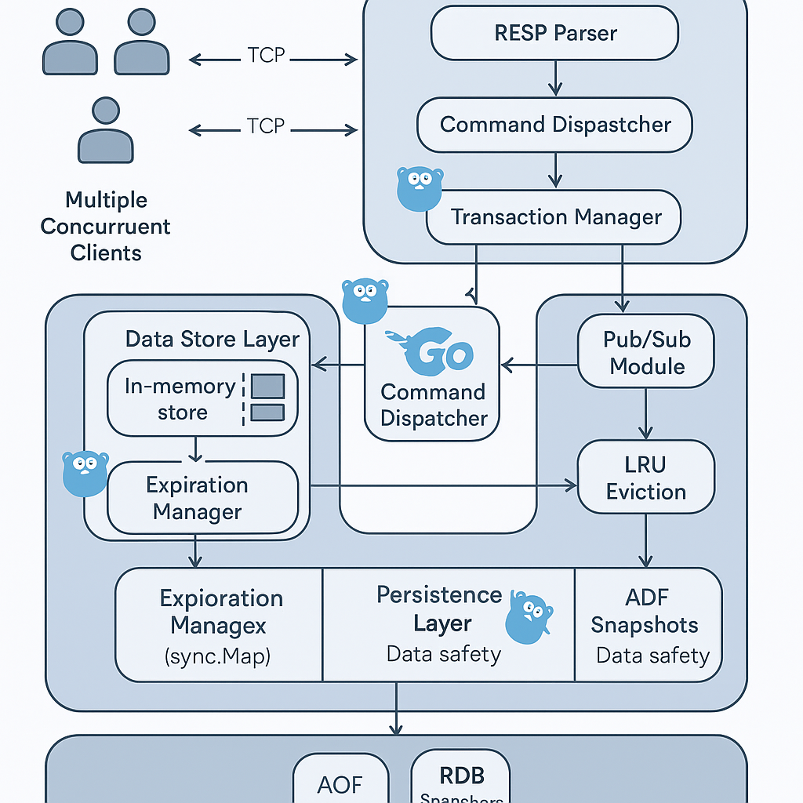

# Redis Clone in Go

A lightweight, in-memory Redis clone built in **Go**🐹 over raw **TCP**, implementing core Redis functionality including transactions, pub/sub, expiration, and LRU eviction.
[](https://github.com/Sagor0078/redis-clone)

---

## Features

### Core Redis Commands
- `GET key`
- `SET key value`
- `DEL key`
- `INCR key` / `DECR key`
- `FLUSHALL`
- `PING`
- `QUIT`

### Expiration Support
- `EXPIRE key seconds` — Set a timeout on a key
- `TTL key` — Get remaining time to live
- Automatic expiry with background eviction.

### Transactions
- `MULTI` — Start transaction
- `EXEC` — Execute queued commands
- `DISCARD` — Cancel transaction
- Queues and executes atomic command blocks per connection

### Publish/Subscribe
- `SUBSCRIBE channel`
- `PUBLISH channel message`
- Real-time pub/sub system with multiple channels

### LRU Cache Eviction
- Auto-evicts **least recently used keys** when size threshold is exceeded
- Built with `container/list` for efficient O(1) updates
- Integrated into `GET`, `SET`, and `DEL` operations

### RESP Protocol Support
- Fully RESP-compliant parser (supports `*`, `$`, `+`, `-`, `:`)
- Allows communication with Redis CLI or custom tools

### Server
- Listens on `tcp://0.0.0.0:6380`
- Handles concurrent clients
- Graceful error handling for malformed inputs

---

## Project Structure

```bash
redis-clone/
├── cmd/                         # Entrypoints for different binaries
│   ├── bench/                   # Benchmark client
│   │   └── bench.go             # Runs benchmark tests on Redis clone
│   └── server/                  # Main server entrypoint
│       └── main.go              # Starts the Redis server
│
├── internal/                   # Core application logic, organized by domain
│   ├── cache/                  # In-memory storage layer
│   │   ├── lru.go              # LRU eviction policy implementation
│   │   ├── lru_test.go
│   │   ├── store.go            # Key-value store with expiration
│   │   └── store_test.go
│
│   ├── command/                # RESP command parsing and execution
│   │   ├── handler.go          # Handles Redis commands: GET, SET, DEL, etc.
│   │   └── handler_test.go
│
│   ├── persistence/           # RDB/AOF Persistence mechanism
│   │   ├── rdb.go              # Dump/load logic for persistence
│   │   └── rdb_test.go
│
│   ├── protocol/              # RESP protocol handling
│   │   ├── buffer_writer.go    # Efficient buffered output
│   │   ├── parser.go           # RESP3-compatible parser
│   │   └── parser_test.go
│
│   ├── pubsub/                # Publish/Subscribe message broker
│   │   ├── pubsub.go
│   │   └── pubsub_test.go
│
│   ├── session/               # Connection/session management
│   │   ├── session.go
│   │   └── session_test.go
│
│   └── transaction/           # MULTI/EXEC transactions
│       └── transaction.go
│
├── img/                        # Architecture or design diagrams
│   ├── sys.png
│   └── sys2.png
│
├── dump.rdb                    # Sample RDB file for persistence testing
├── redis-clone                 # Built binary (created by Makefile)
├── go.mod                      # Go module definition
├── LICENSE
├── Makefile                    # Automates build, test, benchmark, etc.
└── README.md                   # Project documentation

```

### 🛠️ How to Run

```bash
go run cmd/server/main.go
```
Connect using Redis CLI:
```bash
redis-cli -p 6380
```
 Go CLI layout for benchnark:
 ```bash
go run cmd/benchmark/main.go -clients=50 -requests=100
 ```

## Unit Test

> \[!WARNING\]
> ⚠**Tests are currently under construction**   


Some parts of the system aren't fully covered yet, and there are a few known issues we're ironing out.

- Running test for Cache package

```bash
go test ./internal/cache -v
```
- Test file for the command package to test the Handle function,including GET, SET, SET EX, and DEL

```bash
go test ./internal/command -v
```
- Running test for protocol package 
```bash
go test ./internal/protocol -v
```
- Running test for session package
```bash
go test ./internal/session -v
```
- Running test for persistance package
```bash
go test ./internal/persistence -v
```
- Running test for pubsub package
```bash
go test ./internal/pubsub -v
```

## References
This project was inspired by a few projects, books and blog posts, it's based on them with things changed to the way I like
- [redis-internals](https://github.com/zpoint/Redis-Internals/tree/5.0?tab=readme-ov-file)
- [Writing a Redis clone in Go from scratch](https://mliezun.github.io/2023/04/08/redis-clone.html)
- [Go, for Distributed Systems by Russ Cox](https://go.dev/talks/2013/distsys.slide#1)
- [Designing Data-Intensive Applications by Martin Kleppmann](https://www.amazon.com/Designing-Data-Intensive-Applications-Reliable-Maintainable/dp/1449373321)
- and Obviously LLM like (GPT-4o, Claude, Gemini, etc)


## Contributing
Contribution Guidelines

- Fork the repository
- Create a new branch
```bash
git checkout -b feature/
```
- Write tests for new functionality (if possible)
- Run tests locally
- Submit a pull request with a clear description


📌 Todo

- Fix unit tests 
- Add proper LRU caching support 
- Add persistence (RDB/AOF) 
- Build a simple CLI client 
- Benchmarking tool 

